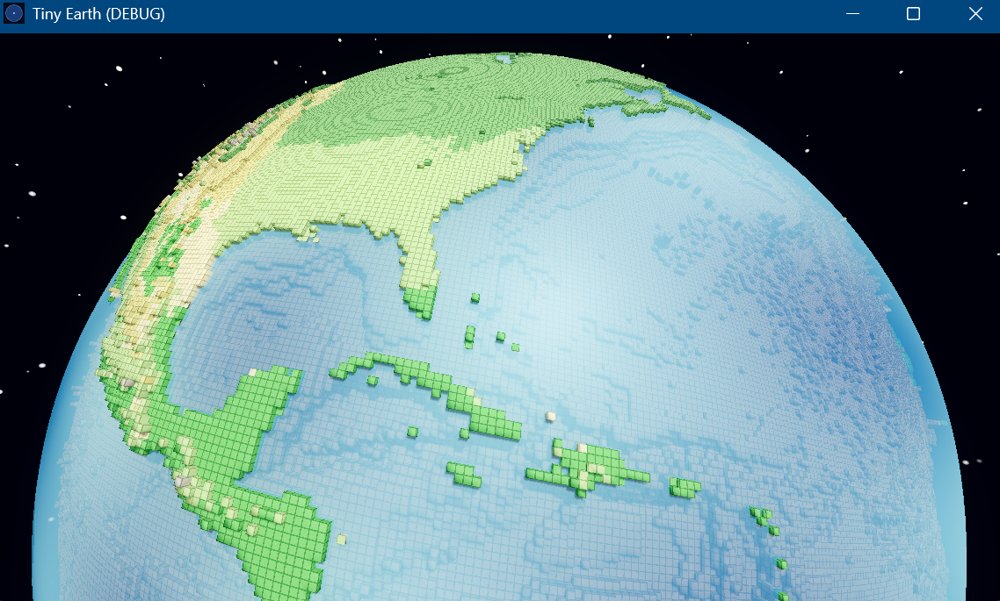
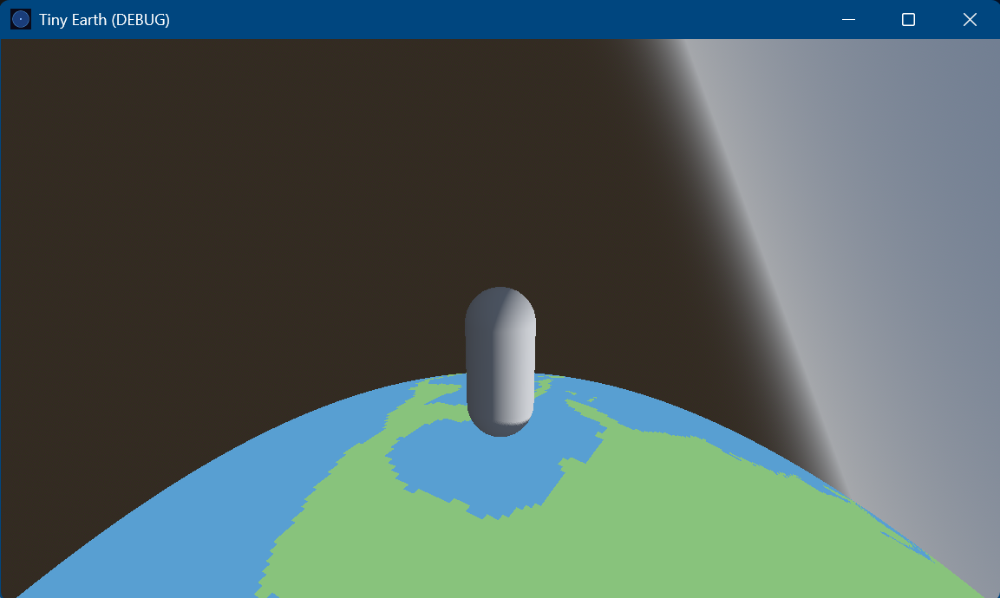

# Tiny Earth

[](https://github.com/jeremybrachle/tiny-earth/actions/workflows/python.yml)
[](https://github.com/jeremybrachle/tiny-earth/actions/workflows/gdscript.yml)


Tiny Earth is a project designed to compress our planet into a walkable quad sphere built with voxels. Kinda like that one popular crafting game you've heard about except this is on a non-flat planet (unfortunately this current model is still geocentric though, I didn't want it to be *too* accurate).

It's not full scale (hence "tiny") but if you ever wanted to walk around a small version of Earth, then you've come to the right place #walkingsimulator






---

## About this project

> *"What is the minimum amount of geographic information required for a human to instantly recognize Earth while still being able to walk around the entire planet in a few minutes?"*

---

## How it's built

Real-world datasets go in one end, voxel chunks come out the other:

```
[Natural Earth]       [ETOPO 2022]          [Köppen-Geiger]
 land + lakes          elevation +           climate zones
 (shapefiles)          bathymetry (NetCDF)   (GeoTIFF)
       │                     │                     │
       ▼                     ▼                     ▼
   landmask.py           elevation.py          biomes.py
  land/ocean mask       stacks voxel          paints each land
  (+ lake subtraction)  columns by height     voxel its biome
       │                     │                     │
       └─────────────────────┴─────────────────────┘
                             │
                             ▼
                         export.py
                bakes the cube-sphere grid into
                zlib-compressed voxel chunks
                             │
                             ▼
            engine/planet/faces/face_N/chunk_X_Y.bin
```

`download.py` fetches and caches the source datasets; `cube_sphere.py` holds the projection math everything else shares. All scripts live in `pipeline/src/`.

The cultural-salience scoring layer — the part that answers the question above — is designed but not written yet. When it lands it'll slot in between the data and the export, deciding what's worth keeping. For now the planet just ships everything.

---

## The engine

Godot 4.x. It's free, MIT-licensed, open source, and doesn't take a cut when this eventually goes up for sale — which is honestly most of why it's here. Everything is GDScript: the voxel mesher, the gravity-driven water, the chunk loading, all of it. No C#, no proprietary engine, no telemetry phoning home.

Architecture notes — the multi-shell voxel design — live in [docs/adr/ADR-001-multi-shell-architecture.md](docs/adr/ADR-001-multi-shell-architecture.md).

---

## Repository layout

```
tiny-earth/
├── README.md
├── CHANGELOG.md
├── LICENSE              # this project's own code
├── ATTRIBUTION.md       # third-party credits + obligations
├── LICENSES.md          # third-party license texts
│
├── pipeline/            # Python: real-world data → voxel chunks
│   ├── config/planet.yaml
│   ├── requirements.txt
│   └── src/
│       ├── cube_sphere.py   # shared projection math
│       ├── download.py
│       ├── landmask.py
│       ├── elevation.py
│       ├── biomes.py
│       ├── interior.py
│       ├── render_map.py
│       └── export.py
│
├── engine/              # Godot 4 project
│   ├── project.godot
│   ├── scenes/          # main_menu, world
│   ├── scripts/         # planet, player, world, ui, audio
│   ├── shaders/
│   ├── audio/
│   ├── test/            # GUT unit tests (projection + voxel-address math)
│   └── planet/          # baked voxel chunks — committed, so it runs on clone
│
├── docs/                # handoff notes + architecture decisions
└── .github/workflows/   # CI: Python, GDScript
```

(`data/` — the raw downloads and cached intermediates — is generated locally and gitignored. The pipeline rebuilds it.)

---

## Getting started

Two ways in. Most people want the first one.

### Just play it

The voxel chunks are committed, so there's no build step — clone it, open the `engine/` folder in Godot 4.x, and hit Play.

```bash
git clone <repo-url>
cd tiny-earth
# open engine/ in the Godot editor, or from the command line:
godot --path engine
```

### Rebuild the planet from scratch (optional)

Only needed if you want to regenerate the world yourself — bump the resolution, swap a data source, that kind of thing. Wants Python 3.11+ and an internet connection for the first fetch (everything caches after that).

```bash
cd pipeline
pip install -r requirements.txt

# fetch + cache the source datasets
python src/download.py            # Natural Earth land
python src/download.py --lakes    #   + lakes
python src/download.py --etopo    # ETOPO 2022 relief (large download)
python src/download.py --koppen   # Köppen-Geiger climate raster

# build the cube-sphere data layers
python src/landmask.py --lakes
python src/elevation.py
python src/biomes.py

# bake the voxel chunks into engine/planet/faces/
python src/export.py --landmask --elevation
python src/interior.py --root .   # subsurface volume
```

---

## Legal & attribution

Everything here is built on open or public-domain data:

| Source | License | Notes |
|---|---|---|
| Natural Earth | Public Domain | Land/lake polygons for the land/ocean mask |
| ETOPO 2022 (NOAA) | Public Domain | Elevation and bathymetry |
| Köppen-Geiger (Beck et al. 2018) | CC BY 4.0 | Biome classification — **attribution required** (see ATTRIBUTION.md) |
| Godot Engine 4.x | MIT | Game engine |
| josebasierra/voxel-planets | MIT | Architectural reference; not directly ported |

Code from `ddupont808/planetcraft` (no license) and the Bowerbyte "Blocky Planet" article (no open license) was studied for architectural reference only — no code copied. Full credit and license obligations are in [ATTRIBUTION.md](ATTRIBUTION.md); full license texts in [LICENSES.md](LICENSES.md).

The project's own code is **all rights reserved** — see [LICENSE](LICENSE).

---

## Development

CI runs on every push and PR (see the badges up top): Python lint + tests, GDScript lint, and CodeQL scanning. The GDScript unit tests (GUT) are run locally. To run the same checks locally:

**Python pipeline** — lint, format, and test:
```bash
cd pipeline
pip install -e ".[dev]"      # installs ruff + pytest
ruff check . && ruff format --check .
pytest tests/ --cov=src
```

**GDScript** — lint and format the engine code:
```bash
pip install "gdtoolkit==4.*"
gdlint engine/scripts
gdformat --check engine/scripts
```

**GDScript unit tests** — run with [GUT](https://github.com/bitwes/Gut) (install it into `engine/addons/gut/`, via the editor's AssetLib or a release zip), then:
```bash
godot --headless --path engine -s res://addons/gut/gut_cmdln.gd -gdir=res://test -gexit
```

---

## Documentation

- [CHANGELOG.md](CHANGELOG.md) — what changed, when
- [ATTRIBUTION.md](ATTRIBUTION.md) — third-party credits and obligations
- [LICENSES.md](LICENSES.md) — full third-party license texts
- [LICENSE](LICENSE) — license for this project's own code
