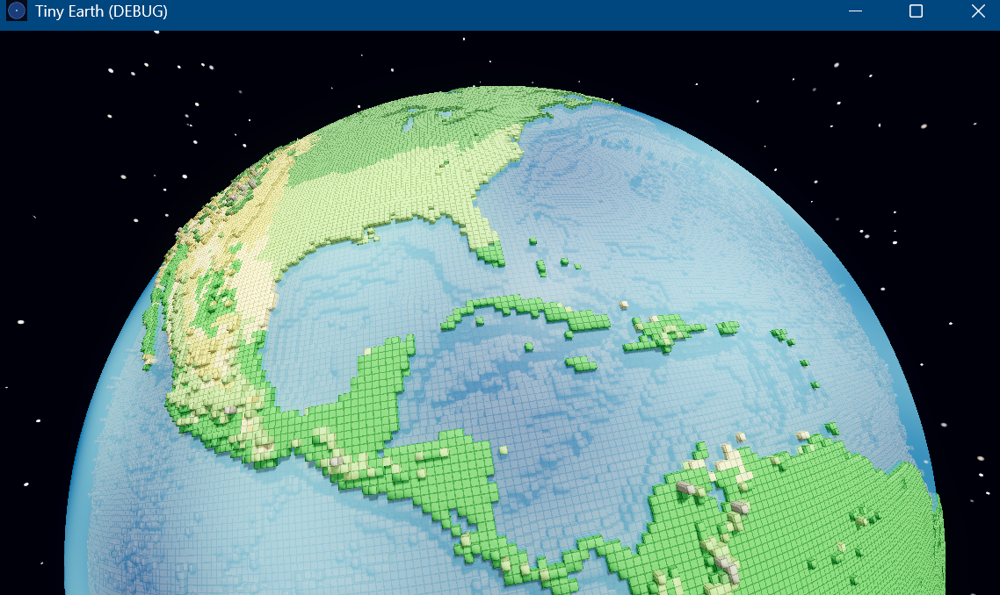
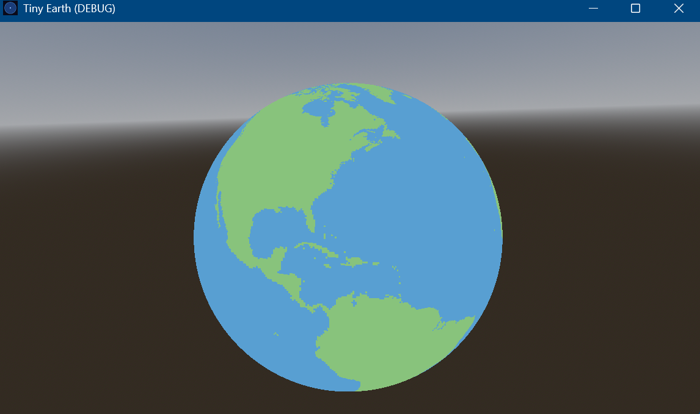

# Tiny Semantic Earth

**Walk around Earth in five minutes. Every feature was chosen by an algorithm.**

Tiny Semantic Earth is a portfolio research project that asks a deceptively simple question: how few geographic features does it take for a human to recognize a globe as Earth? A Python data pipeline fetches land/ocean boundaries, elevation, biomes, cities, capitals, and landmarks from public datasets, ranks every feature using a composite importance score, and exports only the top N survivors to the game engine. The result is a planet you can walk around in minutes, where every placed landmark was chosen by a scoring formula trained on population, cultural prominence, geographic isolation, and transport importance. The project demonstrates GIS data pipelines, game engine integration, procedural generation, and original research framing.







---

## Core Research Question

> *"What is the minimum amount of geographic information required for a human to instantly recognize Earth while still being able to walk around the entire planet in a few minutes?"*

This is not a Minecraft clone. The novel contribution is a **semantic compression engine** — a Python pipeline that ranks real-world geographic features by importance and cultural salience, then projects only the survivors onto a tiny walkable sphere. See [docs/RESEARCH.md](docs/RESEARCH.md) for the full hypothesis, scoring formula, compression ratio concept, and proposed user study design.

---

## Pipeline Overview

```
[Natural Earth]  [ETOPO Relief]  [WWF Biomes]  [OSM / Overpass]
  (shapefiles)    (GeoTIFF)      (polygons)     (cities, landmarks)
       │              │               │                 │
       ▼              ▼               ▼                 ▼
  download.py    elevation.py    biomes.py         fetch_osm.py
  landmask.py        │               │                 │
       │              └───────────────┘                 │
       │                      │             fetch_wiki.py ◄── [Wikipedia Pageviews]
       │                      │             (cultural_salience_index)
       │                      │                 │
       └──────────────────────┴─────────────────┘
                              │
                              ▼
                          score.py
                    (composite importance score)
                              │
                              ▼
                         compress.py
                    (configurable top-N cutoff)
                              │
                              ▼
                          export.py
              ┌───────────────┴───────────────┐
              ▼                               ▼
  data/exports/features.geojson    engine/planet/faces/
  (scored feature set)             face_N/chunk_X_Y.bin
                                   (binary voxel chunks)
```

All scripts live in `pipeline/src/`. See [docs/PIPELINE.md](docs/PIPELINE.md) for stage descriptions, GeoJSON field specs, binary chunk format, and rate-limit handling.

---

## Development Phases

| Phase | Name | Status |
|---|---|---|
| 0 | Foundation — repo, CI, pipeline skeleton, ADRs | Not started |
| 1 | Walkable Sphere — gravity, player movement | Not started |
| 2 | Voxel Planet — cube sphere, chunk system | Not started |
| 3 | Earth Silhouette — land/ocean mask from Natural Earth | Not started |
| 4 | Elevation — ETOPO terrain heights | Not started |
| 5 | Biomes — WWF ecoregion material IDs | Not started |
| 6 | Cities and Semantic Compression Engine | Not started |
| 7 | Landmark Placement — hybrid voxel + low-poly | Not started |
| 8 | Visual Polish and Portfolio Release | Not started |
| A | Stretch — WASM Export | Deferred |
| B | Stretch — User Recognition Study | Deferred |
| C | Stretch — Research Paper | Deferred |
| D | Stretch — Tiny Bay Prototype | Deferred |

See [docs/ROADMAP.md](docs/ROADMAP.md) for goals, deliverables, "done when" success criteria, and the weekend milestone table.

---

## Engine

**Godot 4.x** (MIT license) — fully open source, no runtime fees, native C# support for performance-critical systems (chunk generation, gravity physics), GDScript for rapid game logic. See `docs/adr/001-engine-godot.md` for the full decision rationale.

> **Note:** An `ARCHITECTURE.md` covering engine integration design, sphere mesh strategy, and data-driven placement is planned but not yet written.

---

## Repository Structure

```
tiny-earth/
├── README.md
├── REFERENCES.md
├── ATTRIBUTION.md
├── LICENSES.md
│
├── docs/
│   ├── PIPELINE.md
│   ├── ROADMAP.md
│   ├── RESEARCH.md
│   └── adr/
│       ├── 001-engine-godot.md
│       ├── 002-cube-sphere.md
│       ├── 003-python-pipeline.md
│       ├── 004-chunk-format.md
│       └── 005-hybrid-visual-style.md
│
├── pipeline/
│   ├── config/planet.yaml
│   └── src/
│       ├── download.py
│       ├── landmask.py
│       ├── elevation.py
│       ├── biomes.py
│       ├── fetch_osm.py
│       ├── fetch_wiki.py
│       ├── score.py
│       ├── compress.py
│       ├── cube_sphere.py
│       └── export.py
│
├── engine/                    # Godot 4 project
│   ├── project.godot
│   ├── scripts/
│   │   ├── planet/
│   │   ├── player/
│   │   └── world/
│   ├── assets/landmarks/      # low-poly landmark meshes (.glb)
│   └── planet/                # generated output from pipeline (gitignored raw)
│
├── data/
│   ├── raw/                   # gitignored
│   ├── processed/
│   └── exports/
│
└── .github/workflows/pipeline-test.yml
```

---

## Getting Started

> **Note:** The pipeline and engine are not yet implemented. These instructions are a stub and will be updated as Phase 0 completes.

**Requirements:**
- Python 3.11+
- Godot 4.x
- Internet access for initial data fetch (OpenStreetMap, Natural Earth, ETOPO, Wikipedia)

**Clone:**
```bash
git clone https://github.com/<your-username>/tiny-earth.git
cd tiny-earth
```

**Run the pipeline (once implemented):**
```bash
cd pipeline
pip install -r requirements.txt
python src/export.py --top-n 200
# Outputs: data/exports/features.geojson + engine/planet/faces/
```

**Open the engine project:**
- Open the `engine/` folder as a Godot 4 project in the Godot editor.

---

## Legal and Attribution

This project uses only open or public-domain data sources:

| Source | License | Notes |
|---|---|---|
| Natural Earth | Public Domain | Land/ocean shapefiles for terrain generation |
| OpenStreetMap | ODbL 1.0 | **Attribution required in-game:** "© OpenStreetMap contributors" |
| ETOPO (NOAA) | Public Domain | Elevation and bathymetry data |
| WWF Terrestrial Ecoregions | Non-commercial with attribution | Biome classification |
| Wikipedia Pageviews API | CC BY | Used as a numeric signal only; no article text reproduced |
| Godot Engine 4.x | MIT | Game engine |
| josebasierra/voxel-planets | MIT | Architectural reference; attribution required; not directly ported |

Code from `ddupont808/planetcraft` (no license) and the Bowerbyte "Blocky Planet" article (no open license) was studied for architectural reference only — no code copied. See [docs/REFERENCES.md](docs/REFERENCES.md) for the full catalog with URLs, licenses, and relevance notes for every source. See [ATTRIBUTION.md](ATTRIBUTION.md) for third-party license obligations and [LICENSES.md](LICENSES.md) for full license texts.

---

## Documentation

- [docs/PIPELINE.md](docs/PIPELINE.md) — Data pipeline stages, GeoJSON schema, binary chunk format, rate limits
- [docs/ROADMAP.md](docs/ROADMAP.md) — Development phases, success criteria, weekend milestone table
- [docs/RESEARCH.md](docs/RESEARCH.md) — Research hypothesis, scoring formula, compression ratio, user study design
- [docs/REFERENCES.md](docs/REFERENCES.md) — All external sources with URLs, licenses, and relevance notes
- [ATTRIBUTION.md](ATTRIBUTION.md) — Third-party license obligations
- [LICENSES.md](LICENSES.md) — Full license texts
